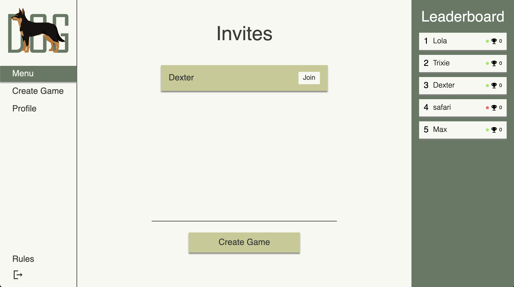
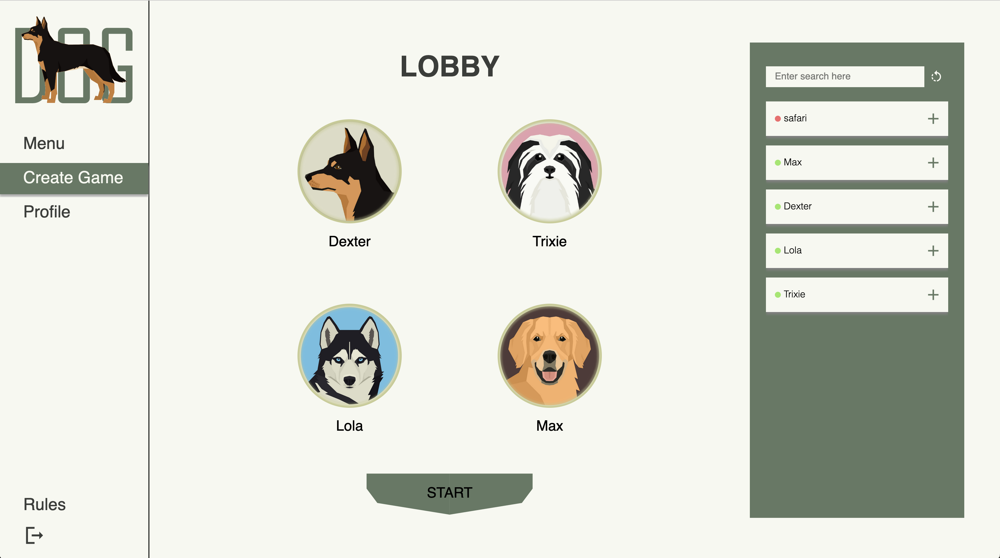

# SoPra FS22 Brändi Dog (Client)

# Introduction
The aim of our project was to develop an online version of the popular Swiss board game "Brändi Dog". We wanted to make a more accessible version of the game that you can play from anywhere. Our version lets you play from anywhere if you have an internet connection and a modern browser (no guarantees for Internet Explorer). The game interface should be familiar to people who have already played the game and if needed be there is a small section with the rules. Our version provides some features that the physical version of the game doesn't have, most notably that it shows you where your marble can move based on the chosen card. Our external API enables the use of voice communication, so the players can talk to each other while playing (not moderated).

# Technologies
Frontend

- **React / JavaScript / Node.js / Mui Framework** - Frontend Development
- **SockJS / STOMPJS** - Websocket (Frontend)

Backend

- **Java** - Backend Development Language
- **Gradle** - Build-Automation
- **Spring Boot Web** - RESTful service
- **Spring Boot Websocket** - Websocket (Backend)
- **JPA** - Database interface

Various
- **PostgreSQL** - Production Database
- **GitHub** - Version control, Deployment
- **Heroku** - Deployment

# High-level components
## High-level components: Frontend

### [The Menu](https://github.com/sopra-fs22-group-13/braendi-dog-client/blob/main/src/components/views/Menu.js)
On a very basic level, the frontend has two states: Outside a game and inside a game.
When outside a game, the user will usually find themselves in the main menu. From the main menu they can directly perform most other functionalities.
These include, but are not restricted to, visiting a profile, opening a game lobby and joining an existing lobby.
The menu page is constructed from the Menu.js component.

### [The Marbles component](https://github.com/sopra-fs22-group-13/braendi-dog-client/blob/main/src/components/views/Marbles.js)
The Marbles component is essential for pretty much all interactions within a game. It not only displays the current marbles on the board but rather handles all attributes of marbles in a game. When selecting a marble, the marble component handles the click, highlights the marble, and waits for the next click. It also displays the calculated possible move positions after a start has been selected. Furthermore, it displays the button to end a move and is in tight coordination with the [moveManager class](https://github.com/sopra-fs22-group-13/braendi-dog-client/blob/main/src/helpers/moveManager.js), Which sends the move to the server and keeps track of the move's state in general.

## High-level components: Backend
The centerpieces of the server-side application are the UserService, the Lobby and the Game and Board classes.
These classes embrace the core functionalities of the application and changes in these classes are what is most easily visible on the client side.

The main function is embedded within the [Application.java](https://github.com/sopra-fs22-group-13/braendi-dog-server/tree/main/src/main/java/ch/uzh/ifi/hase/soprafs22/Application.java) file.
This method doesn't have notable responsibilities besides starting up the program.

### [The UserService class](https://github.com/sopra-fs22-group-13/braendi-dog-server/tree/main/src/main/java/ch/uzh/ifi/hase/soprafs22/rest/service/UserService.java)
This class manages everything that interacts with the user repository.
It is therefore responsible for registering, updating and retrieving users, as well as being responsible for the authentication.
The UserService class is mostly operated by the UserController, which manages all requests from the client concerning the user repository,
but it also communicates with other classes, which might need information about users.

### [The LobbyManager class](https://github.com/sopra-fs22-group-13/braendi-dog-server/tree/main/src/main/java/ch/uzh/ifi/hase/soprafs22/lobby/LobbyManager.java)
Before a game is created, there needs to be a lobby where 4 users gather. These lobbies exist in the backend as instances of the Lobby class.
The managing of the lobby instances is done by the LobbyManager class, which itself is operated by the LobbyController.
Similar to the UserController, the LobbyController catches all requests from the client concerning the lobby.
The LobbyManager then processes all requests received by the controller after they have been interpreted and validated by the controller.

### [The Game class](https://github.com/sopra-fs22-group-13/braendi-dog-server/tree/main/src/main/java/ch/uzh/ifi/hase/soprafs22/game/gameInstance/Game.java)
After a lobby is filled and a game is started, this game exists as an instance of the Game class.
Similar to the LobbyManager class, there also exists a GameManager class which keeps track of the existing game instances, as well as a GameController, which receives all requests concerning the game instance.
However, the controller also performs some actions directly on the game instance, instead of exclusively communicating with the GameManager.
An important component of the Game class is the Board class. Each game instance holds a board instance, which takes over a lot of responsibilities concerning the state of the game.

# Launch & Deployment
For your local development environment, you will need Node.js. You can download it [here](https://nodejs.org). All other dependencies get installed with:

```npm install```

Run this command before you start your application for the first time. Next, you can start the app with:

```npm run dev```

The application will now listen on [http://localhost:3000](http://localhost:3000).

This is the client application. It will run without the server, but functionality is minimal. For all functions, the client expects the [server](https://github.com/sopra-fs22-group-13/braendi-dog-server) to listen on [http://localhost:8080](http://localhost:8080).

## Build
`npm run build` builds the app for production to the `build` folder.<br>
It correctly bundles React in production mode and optimizes the build for the best performance: the build is minified, and the filenames include hashes.<br>

See the section about [deployment](https://facebook.github.io/create-react-app/docs/deployment) for more information.

# Illustrations
The user starts on the login page where they either log in to an existing account or register a new one. After that they get redirected to the menu page. <br>
<p align="center">
    
</p>
From the menu page the user starts a new game by clicking on "Create Game" to get to the lobby page.<br>
From the lobby page the user invites 3 other users over the searchbar component to join their lobby.
<br><br>
<p align="center">
    
</p>
Once the lobby is full, the lobby owner can start the game and everyone gets redirected to the game page. <br><br>
<p align="center">
    
</p>
The game page is the main page of our web application. After the game of dog is completed, every user gets redirected to the menu page again. <br>
Alternatively to starting a game, the user could also view or edit their profile. <br><br>
<p align="center">
    
</p>

# Roadmap
With a fully functioning base version of the game, the next steps to develop the application in the future would be:

- **Game mode 'Team play'** <br> In this game mode 2 players go up against another team. This enhances strategic gameplay and would include the swap of a card with your teammate at the beginning of each round and the possibility to move each other's marbles under certain conditions (see original [instructions of Brändi Dog](https://www.braendi-dog.de/braendi-dog-spielregeln-anleitungen.html)).
- **Implementation of an AI opponent** <br> In this game mode the AI compensates for any missing players, allowing for a game of dog with less than 4 users. This increase the user experience and advance the playability of the application.
- **Refactoring the Marbles class** <br> This step only affects the Frontend. Currently the Marbles class has too many responsibilities and collected quite some technical debt. Refactoring it would increases the evolvability and maintainability of the application.

# Authors
[Luca Zwahlen](https://github.com/LucaZwahlen) - [Simona Borghi](https://github.com/BlackStar5044) - [Sandro Vonlanthen](https://github.com/SandroVonlanthen) - [Shitao Zeng](https://github.com/shzeng) - [Anton Crazzolara](https://github.com/Xyarlo)

# License
This Project is licensed under GNU General Public License v3.0. See [COPYING](COPYING) for more.

# Acknowledgments
Thank you @joelruettimann for tutoring and overlooking this project. Thank you @royru , @realChesta , @alexscheitlin , @jan-kreischer , @alainkueng , and @solodezaldivar for providing the template for this project.
